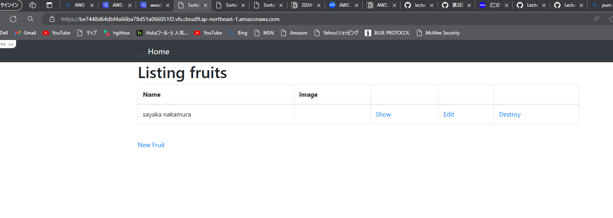
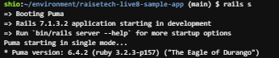
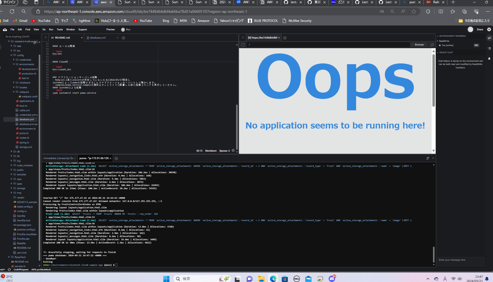
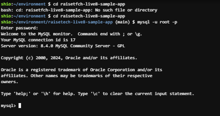
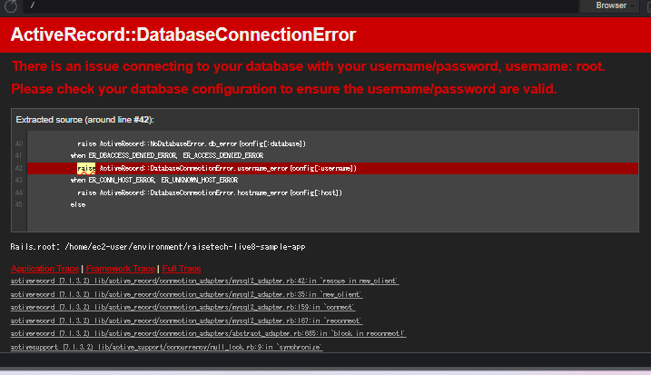

## 第三回講義課題

**アプリケーション起動**

- **APサーバの名前とバージョンについて**

  名前：puma

  バージョン：6.4.2
  

  APサーバを終了させたとき引き続きアクセスできなくなる
  

- DBサーバの名前とバージョンについて**  

  名前：MysQl  
  
  バージョン：8.4.08.4.0

  

　　DBサーバを終了したときにアクセスできなくなる

  

  
  
## 講義を通しての感想  

なぜの繰り返しで質問回数も多かった。質問を通して自分のいま抱える課題が理解できたことは大きな収穫であった。
エラーがどこで起きているか理解ができないので修正することができずつまづいたので、作業が一段階進むごとに確認するなどの対策が必要だと感じた。

　

