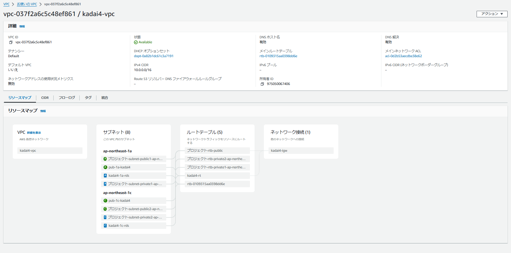
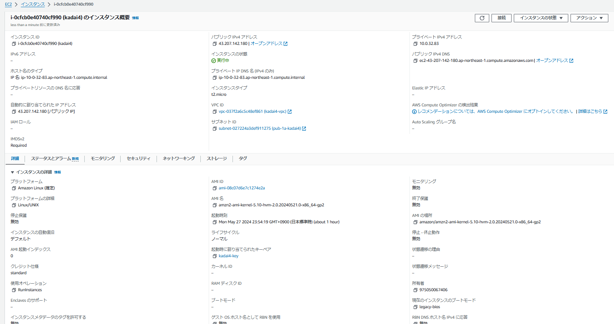
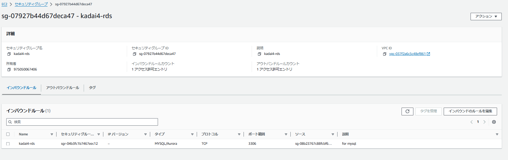
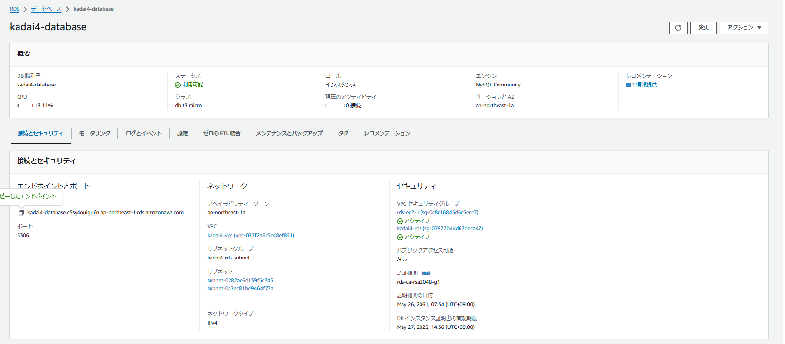
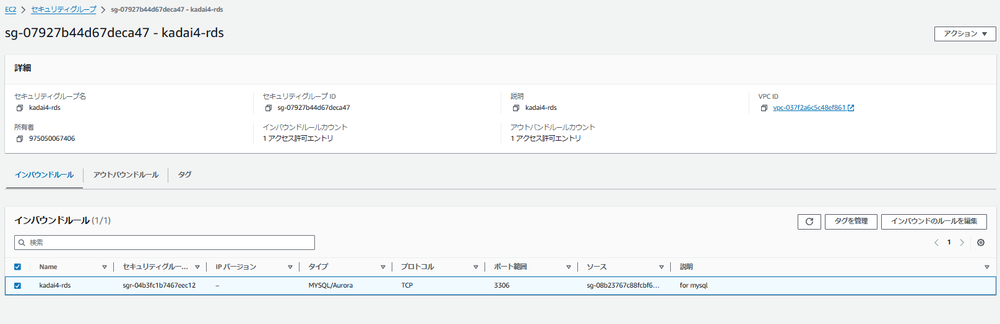
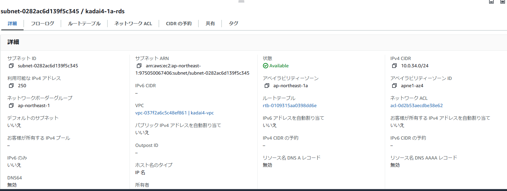
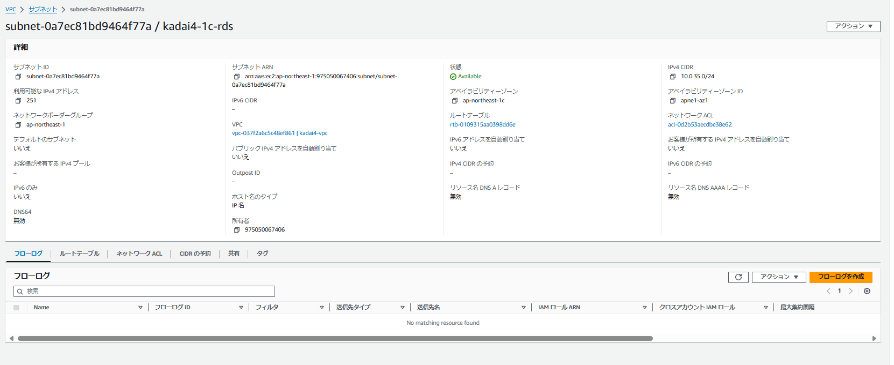
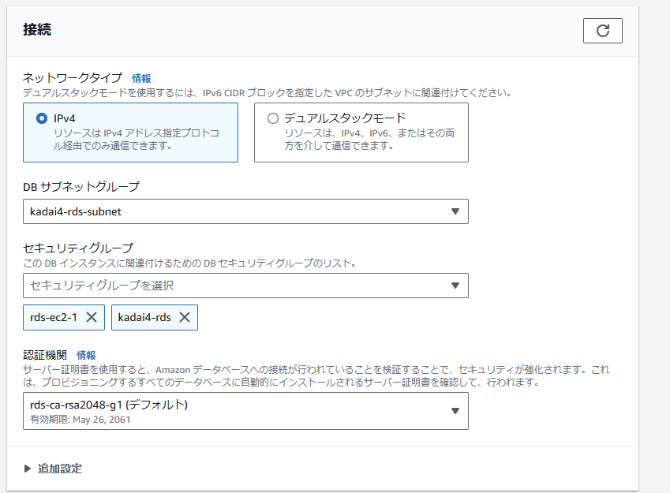
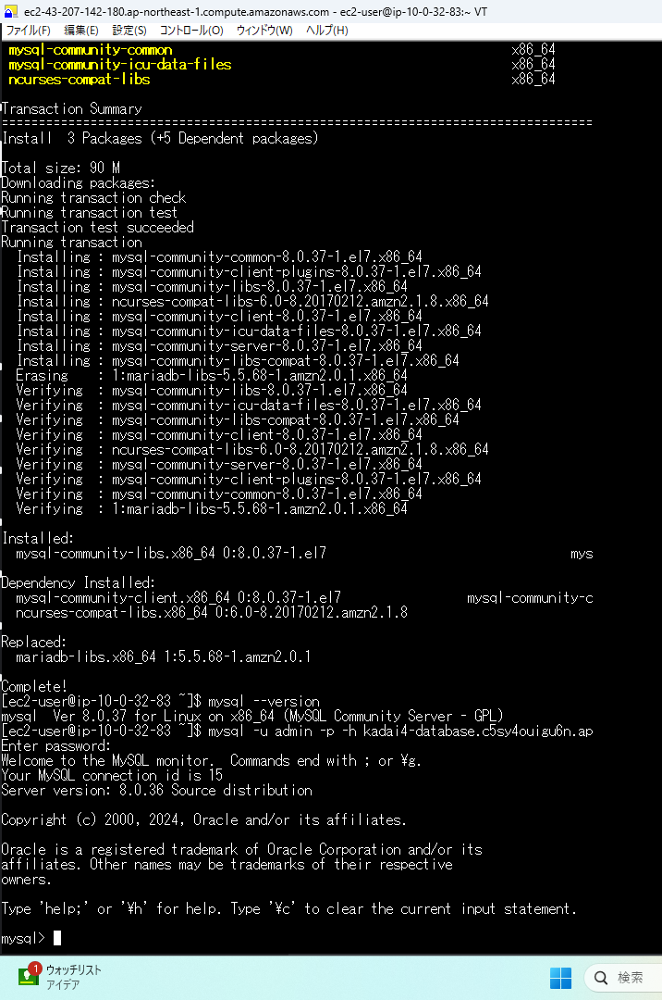

# 第四回課題　　

 
- VPC及びサブネットの構築

- EC2の作成  

  

- EC2のインバウンドルール  

  

- RDSの作成  

- RDSのインバウンドルール  

　　

- RDSのサブネット  

  

  

- EC2からRDSの接続  

  

- #### 感想  

VPCやサブネットを部屋として考えながら作業をすると、どこにエラーが出ているのかがわかりやすかった。
mysqlをインストールするところでつまずいたが、エラー内容から対策を考え実施して成功したときはとても達成感があった。

