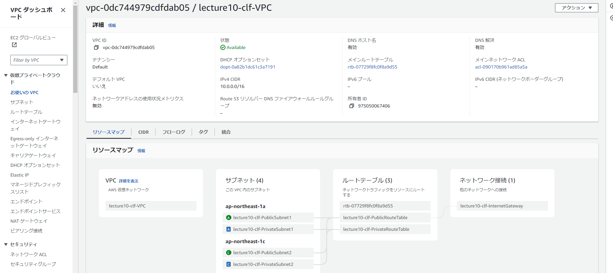

# 第10回課題  
## 課題内容  
CloudFormationを使用した環境構築の自動化  

## 1 ネットワーク環境の構築
[network](/yml/1network.yml)  

VPC  
 

パブリックサブネット  
   
  

プライベートサブネット  
   
  

ルートテーブル  
パブリック用  
  

プライベート用  

インターネットゲートウェイ  

## 2 セキュリティグループ  
[network](lecture10/security.yml)  

EC2のセキュリティグループ  
  

RDSのセキュリティグループ  
  

ALBのセキュリティグループ  
  

## 3 EC2 
[application](lecture10/application.yml)  

作成したEC2とSSH接続の確認  
  

IAMRole  
  

## 4 RDS  
[application2](lecture10/application2.yml)  

作成したRDS  
  

RDS接続確認  
  

## 5 ALB  
[application3](lecture10/application3.yml)  

作成したALB  

ターゲットグループ  
  

## 6 S3  
[application4](lecture10/application4.yml)  

作成したS3と動作確認  
  

## 感想　　
スタック作成時に何度もエラーを出された。その都度対応していくうちにエラー文を読むと、引っかかっている部分がわかり自力で解決できたことに成長を感じた。　　
今回は初めてのクラウドフォーメーションを利用しての環境構築であった為、テンプレートファイルを細かく分けた方がやりやすいのでは？と考えたが、メンテナンスや管理のことを考えると、一つにまとめた方がよいのではないかと思った。

