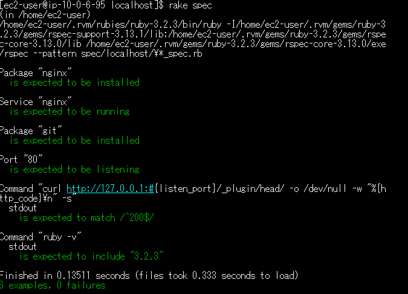

## 第十一回課題  
### serverspecのテスト手順  
- 前提条件  
第十回で構築した環境、及びインストールしたサンプルアプリケーションを使用すること  
サンプルアプリケーションが起動できる事  

- 手順  
[公式ページ](https://serverspec.org/)の手順に従い作成  

#### 1 serverspecをインストール 
```bash:title
$ gem install serverspec  
#ec2-user配下でインストール  
```

#### 2 serverspecのテスト環境を設定  
```bash:title
$ serverspec-init  
#コマンドを入力すると以下写真のように選択肢が表示される  
#選択が終わるとspecディレクトリが表示される  
```


#### 3 テストコードを記述    
今回は授業で配布された[テストコード](https://github.com/MasatoshiMizumoto/raisetech_documents/tree/main/aws/samples/serverspec)を元にカスタマイズして使用する。  
```bash:title
$ cd spec/localhost  
#local環境にてテストを実行  
$ vim sample_spec.rb  
#テストコードを打ち込む  
```
#### テストコード  
```bash:title  
require 'spec_helper'

listen_port = 80
#Nignxがインストール済みであるか
describe package('nginx') do
  it { should be_installed }
end

#Nignxが起動しているか
describe service('nginx') do
  it { should be_running }
end

#gitがインストールしてあるか
describe package('git') do
  it { should be_installed }
end

#指定のポートがリッスンであるか
describe port(listen_port) do
  it { should be_listening }
end

#curlでHTTPアクセスして200 OKが返ってくるか
describe command('curl http://127.0.0.1:#{listen_port}/_plugin/head/ -o /dev/null -w "%{http_code}\n" -s') do
  its(:stdout) { should match /^200$/ }
end

#コマンドの標準出力から指定のバージョンがインストールされているか
describe command('ruby -v') do
  its(:stdout) { should include '3.2.3' }
end


```  
#### 4 テスト実行  
$ rake spec  
#localhostディレクトリにて  

成功した時  
  
失敗（テストコードで打ち込んだポート番号が違う）  

