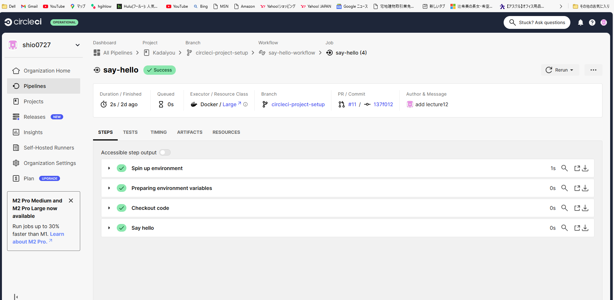
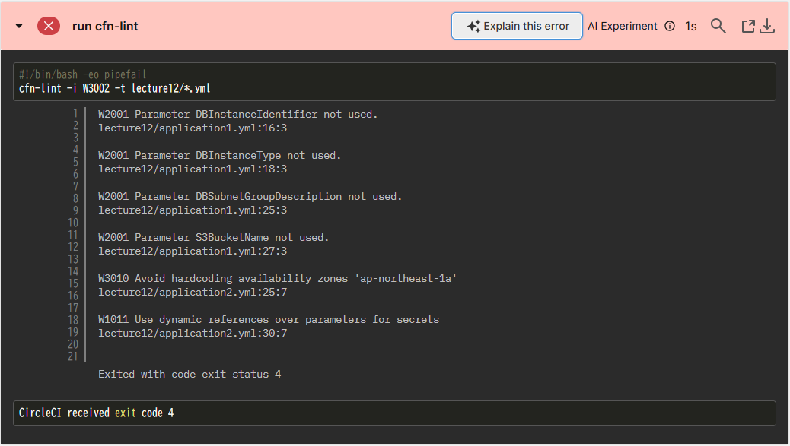
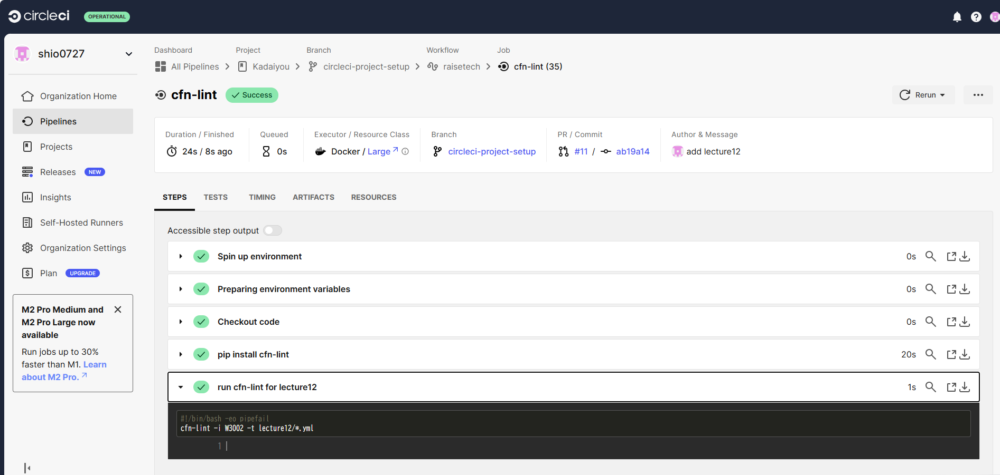

## 第十二回課題  
CircleCIのサンプルconfigをGitリポジトリに取り込み、動作させる。  
### CircleCIとは？  
Saas型のCI/CDサービスの事。CI/CDツールとはアプリケーションやインフラ環境のコードに関わる部分のテストを自動化し、常にリリース可能な状態にする。  
### CircleCIのアカウント登録と初期設定と動作確認  
[公式ドキュメント](https://circleci.com/docs/ja/getting-started/)に沿って操作し、動作について理解を深める。  
  
### サンプルconfigをリポジトリに組み込む  
- sayhelloの際に作成したブランチをリモートからローカルにクローンする  
- github公開鍵を登録  

```bash:title  
$ cd ~/.ssh  
#鍵を入れるフォルダに移動  
$ ssh-keygen -t rsa  
#3回エンターキーを叩く　
#公開鍵をgithubに登録する。  
```  
- 第十回で製作した[ymlファイル](lecture12)を格納してconfigファイルを書き換える  

```bash:title  
#サンプルconfig  
version: 2.1
orbs:
  python: circleci/python@2.0.3
jobs:
  cfn-lint:
    executor: python/default
    steps:
      - checkout
      - run: pip install cfn-lint
      - run:
          name: run cfn-lint
          command: |
            cfn-lint -i W3002 -t ~/lecture12/*.yml

workflows:
  raisetech:
    jobs:
      - cfn-lint  

```  
      
### warning発生  
  

#### W2001 パラメーターが使用されていない。  
→該当するパラメーターを削除  
#### W3010  ハードコーディングエラー　　
```bash:title  
AvailabilityZone: !Select 
        - 0
        - Fn::GetAZs: !Ref AWS::Region  
        
#AvailabilityZone: ap-northeast-1から上記のように修正  
```  
#### W1011 動的参照を使用していないため  
```bash:title  
MasterUserPassword: "{{resolve:ssm-secure:rdskey:1}}"  
#パラメーターストアでパラメーターを作成したのち、 MasterUserPassword: !Ref DBPasswordから上記のように変更  
```
pushしたのち再び再試行  
  

### 今回操作して思った事  
今回は初めて行った為、公式ドキュメントに沿って作成したブランチをサンプルconfigに利用したが、あらかじめブランチ作成しそれを利用することもできるので次回からはあらかじめブランチを製作した後にCircleCIで使用した方が良いと思った。
課題を提出した段階では、Warningはエラーではないと考え検知を外すようにconfigを書き換えたが、ベストプラクティスに沿って考えると修正した方が良いことに気が付きymlファイルを修正した。今回CircleCIを試したことで、動的参照についても学ぶことができたためとても有意義であった。


