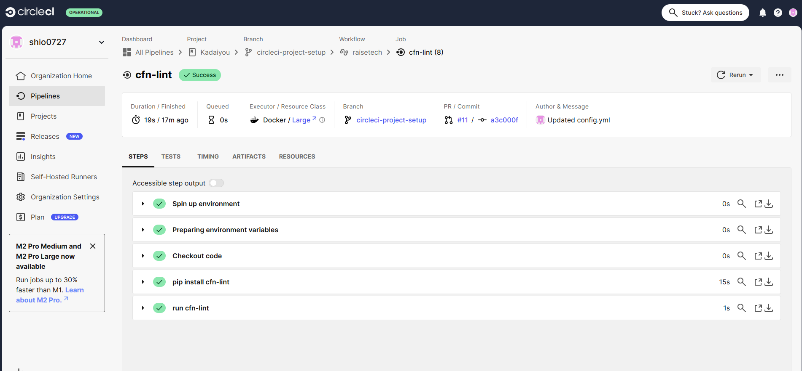
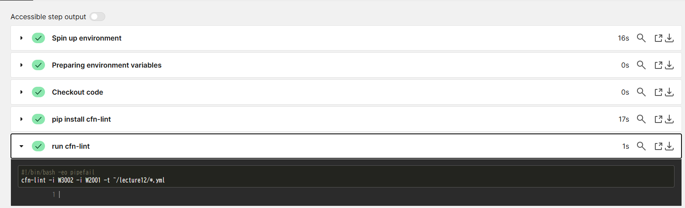

## 第十二回課題  
CircleCIのサンプルconfigをGitリポジトリに取り込み、動作させる。  
### CircleCIとは？  
Saas型のCI/CDサービスの事。CI/CDツールとはアプリケーションやインフラ環境のコードに関わる部分のテストを自動化し、常にリリース可能な状態にする。  
### CircleCIのアカウント登録と初期設定と動作確認  
[公式ドキュメント](https://circleci.com/docs/ja/getting-started/)に沿って操作し、動作について理解を深める。  
  
### サンプルconfigをリポジトリに組み込む  
- sayhelloの際に作成したブランチをリモートからローカルにクローンする  
- github公開鍵を登録  

```bash:title  
$ cd ~/.ssh  
#鍵を入れるフォルダに移動  
$ ssh-keygen -t rsa  
#3回エンターキーを叩く　
#公開鍵をgithubに登録する。  
```  
- 第十回で製作した[ymlファイル](lecture12)を格納してconfigファイルを書き換える  

```bash:title  
#サンプルconfig  
version: 2.1
orbs:
  python: circleci/python@2.0.3
jobs:
  cfn-lint:
    executor: python/default
    steps:
      - checkout
      - run: pip install cfn-lint
      - run:
          name: run cfn-lint
          command: |
            cfn-lint -i W3002 -t ~/lecture12/*.yml

workflows:
  raisetech:
    jobs:
      - cfn-lint  

```  
      
warning発生  
  
warningコードW2001を検知対象外にすることによりwarningが出されないようにする。  
```bash:title  
  
version: 2.1
orbs:
  python: circleci/python@2.0.3
jobs:
  cfn-lint:
    executor: python/default
    steps:
      - checkout
      - run: pip install cfn-lint
      - run:
          name: run cfn-lint
          command: |
            cfn-lint -i W3002 -i W2001 -t ~/lecture12/*.yml

workflows:
  raisetech:
    jobs:
      - cfn-lint  
      
```  
変更し再試行  
  
- 今回操作して思った事  
今回は初めて行った為、公式ドキュメントに沿って作成したブランチをサンプルconfigに利用したが、あらかじめブランチ作成しそれを利用することもできるので次回からはあらかじめブランチを製作した後にCircleCIで使用した方が良いと思った。

補足内容  

- Warning発生時に出現していたW2001以外のWarningについて  
W2001を検知対象外にした際に出現しなくなった。  
- 警告コード内容  
W2001 パラメーターが使用されていない  
W3010 可用性ゾーンのプロパティはハードコードすべきではない  
W1011 シークレットのパラメーターを使用する代わりに動的参照を使用する。

 


