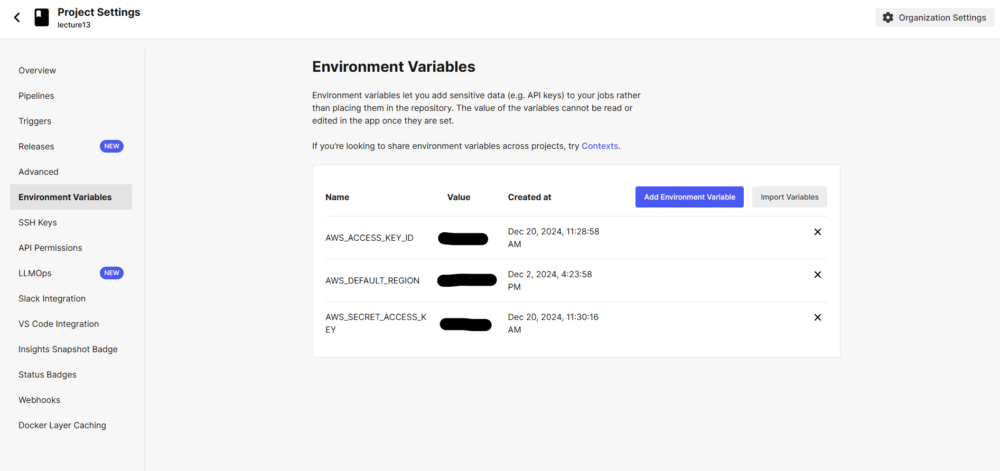
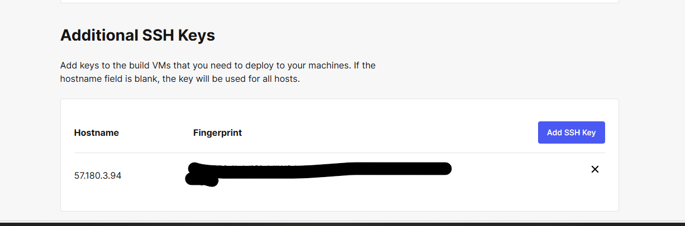
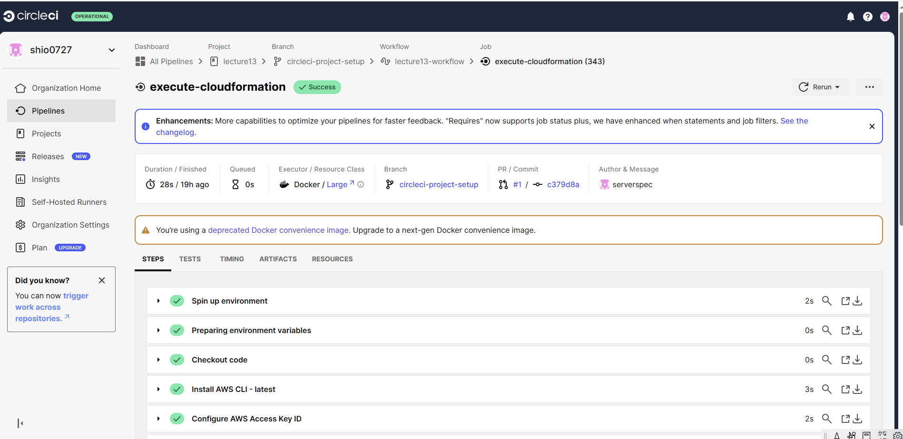
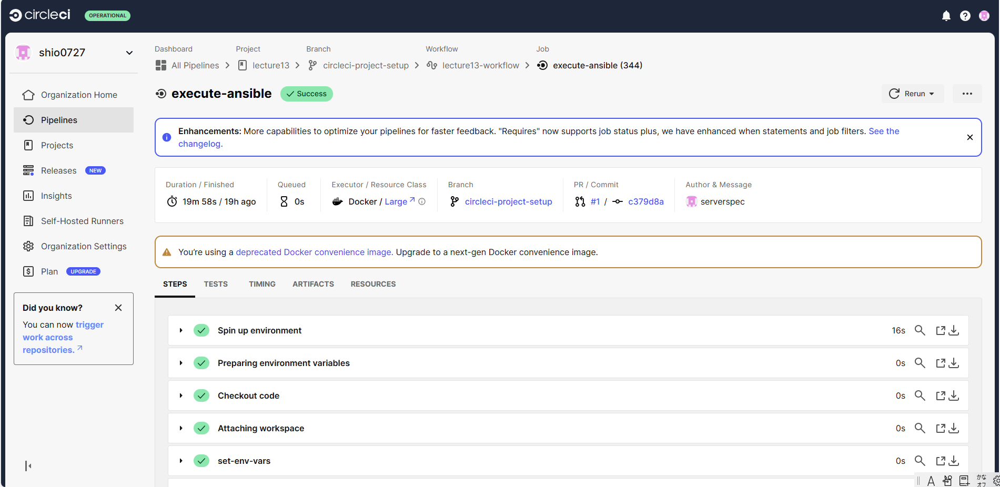
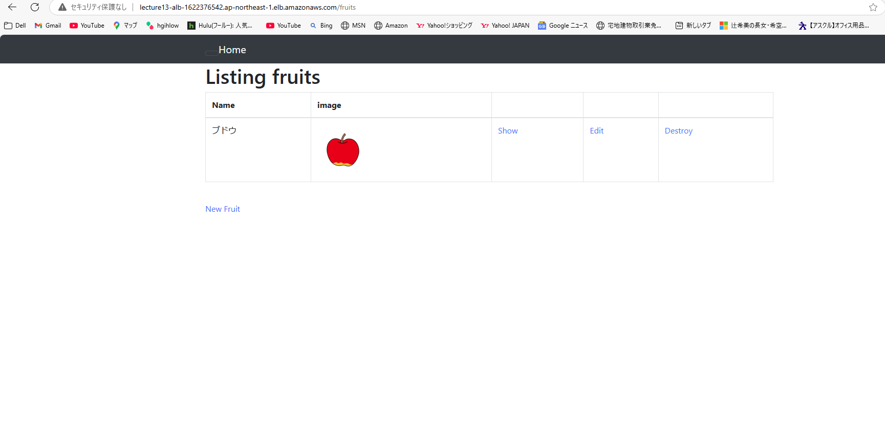
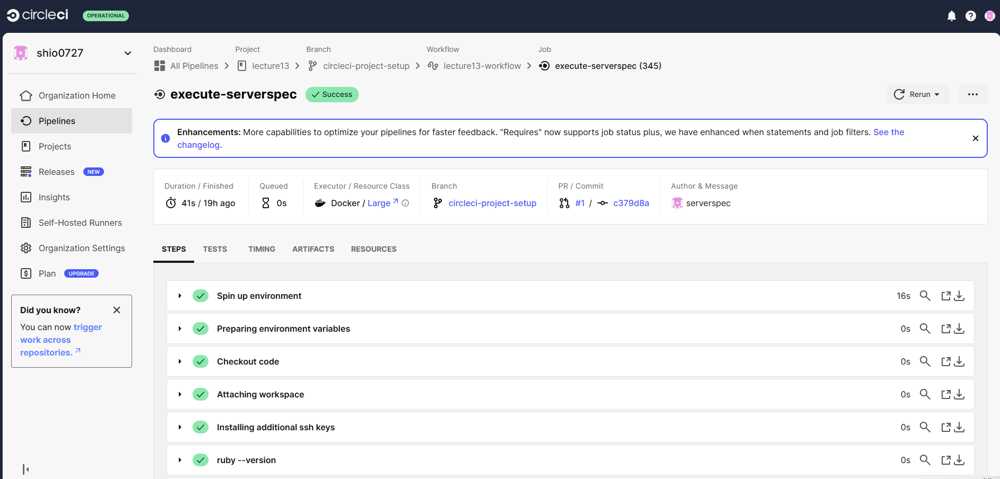

## 第十三回課題  
### 課題内容  
- CircleCiにAnsibleとServerSpecを追加して実行する。  
[課題に使用したリポジトリはこちら]()  

### 1 CircleCiに環境変数とSSH Keysを設定  
- 環境変数「AWS_ACCESS_KEY_ID」「AWS_DEFAULT_REGION」「AWS_SECRET_ACCESS_KEY」を設定  

- 「SSH Keys」を設定  

### 2 Cloudformationの実施  
RDSのパスワードはシークレットマネージャーで事前に決めたものを使用  
  
[Cloudformationテンプレートファイル]()

### 3 Ansibleの実施  
CircleCiをコントロールノード、AWSのEC2（前工程で作成）をターゲットノードとして、第三回講義の際に配布されたサンプルアプリケーションのデプロイを行った。 
  
  
[Ansibleのテンプレートファイル]()  

### 4 serverspecの実施  
CircleCi上でserverspecを実施した。  

[Ansibleのテンプレートファイル]()   
### 5 感想  
Ansibleの成功までかなり時間を要してしまった。Cloudformationで作成したリソースの値をAnsibleに渡す設定に手間取ってしまった。環境変数とは何かもう一度見直す良い機会になった。  
手動でアプリケーションを起動させる時とは違った難しさがあったが、一度起動できてしまえば再現性が高いので、タイムパフォーマンス的には良いのではないかと思った。