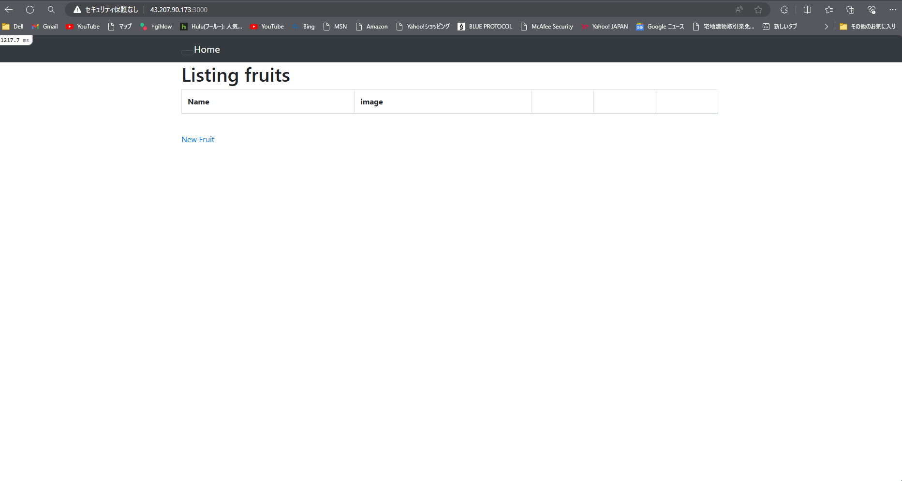
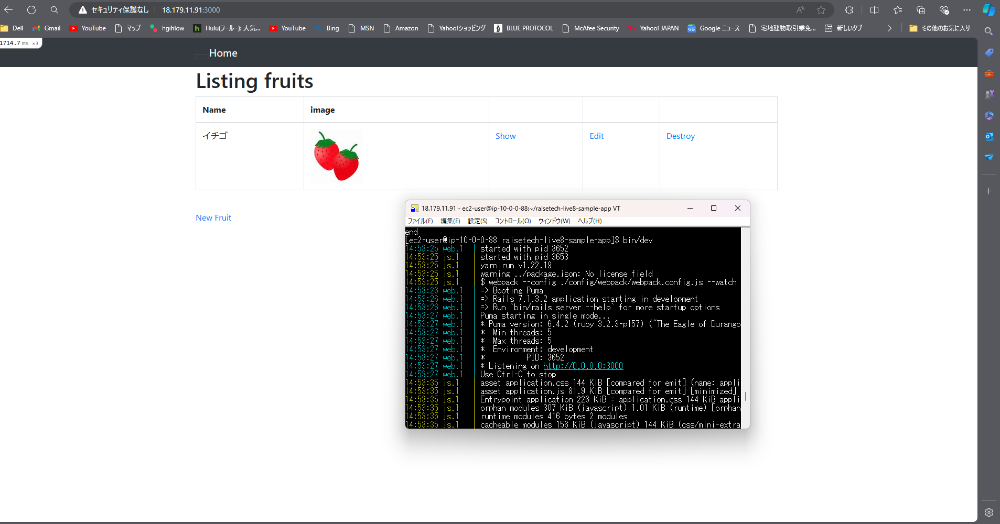

# 第五回講義  
## 1.EC2上にサンプルアプリケーションをデプロイ 
1.1 組み込みサーバ「puma」のみの起動 

各種パッケージのインストール  

```bash:title 
   $ sudo yum -y update
   $ sudo yum -y install gcc-c++ make patch git curl zlib-devel openssl-devel ImageMagick-devel readline-devel libcurl-devel libffi-devel libicu-devel libxml2-devel libxslt-devel mysql mysql-devel
```
- ruby  
```bash:title
   $ command curl -sSL https://rvm.io/mpapis.asc | gpg2 --import -
   $ command curl -sSL https://rvm.io/pkuczynski.asc | gpg2 --import -
   $ curl -L get.rvm.io | bash -s stable
   $ source ~/.bashrc
   $ source ~/.rvm/scripts/rvm
   $ rvm get head
   $ rvm install 3.2.3
   $ rvm --default use 3.2.3
   $ echo source ~/.rvm/scripts/rvm >> ~/.bashrc
   $ ruby -v
```
- bundler  
```bash:title
   $ gem install bundler -v 2.3.14
   $ bundler -v
```
- node  
```bash:title
   $ curl -o- https://raw.githubusercontent.com/nvm-sh/nvm/v0.39.2/install.sh | bash
   $ source ~/.nvm/nvm.sh
   $ nvm install v17.9.1
   $ node -v
```
- yarn
```bash:title
   $ npm install -g yarn
   $ yarn set version 1.22.19
   $ yarn -v
```
- rails  
```bash:title
   $ gem install rails -v 7.1.3.2
```
1.2 サンプルアプリケーションをクローン
```bash:title
   $ git clone https://github.com/yuta-ushijima/raisetech-live8-sample-app.git
```
1.3 DBの設定と接続確認

- database.ymlの作成  
```bash:title
   $ cd raisetech-live8-sample-app
   $ cp -p ./config/database.yml.sample ./config/database.yml
```
- database.ymlの修正  
[database.yml.sample](img5/step1/database.yml)
```bash:title
   $ vi ./config/database.yml
   $ cat ./config/database.yml
```
1.4 環境構築・アプリケーション起動
```bash:title
 　$ bin/setup
 　$ sudo chmod 755 bin/dev
 　$ bin/dev
```
- アプリケーション起動方法  

　http://EC2グローバルIP：80






