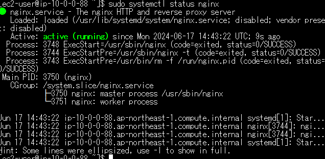
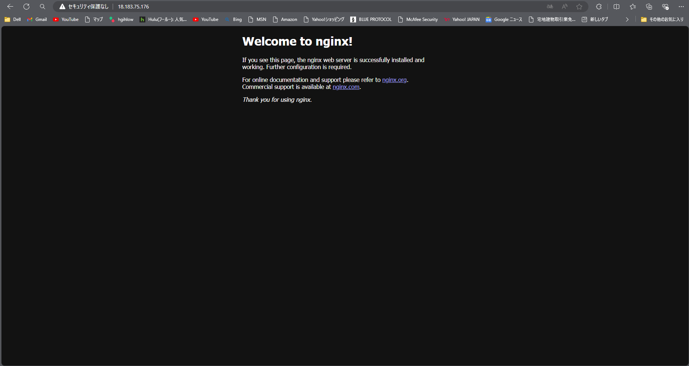

# 3 nginx単体起動 
3.1 nginxをインストール
```bash:title
$ sudo amazon-linux-extras install nginx1
$ nginx -v
```
3.2 nginxを起動
```bash:title
$ sudo systemctl start nginx
$ sudo systemctl status nginx
#EC2のセキュリティーグループのインバウンドルールの3000番を削除し、80番を追加する 
```
3.3 接続確認 
http://グローバルIP/で接続  
  



