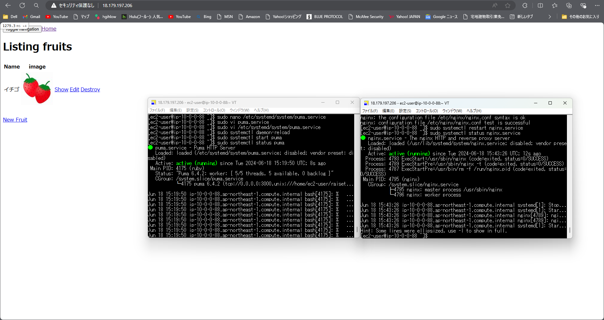

# 4 組み込みサーバーとnginxでのアプリケーション起動 

## nginx
4.1 /etc/nginx/nginx.confを編集

```bash:title 
#変更
- user nginx;からec2-user 
- server {
       listen       80;
       listen       [::]:80;
       server_name  localhost;
#追加
- upstream puma {
     server unix:///home/ec2-user/raisetech-live8-sample-app/tmp/sockets/puma.sock;
  } 

- location / {
    try_files $uri $uri/index.html $uri.html @puma;
    } 

- location @puma {

           #proxy_read_timeout 300;
           #proxy_connect_timeout 300;
           proxy_redirect off;
           proxy_set_header X-Forwarded-Proto $scheme;
           proxy_set_header Host $http_host;
           proxy_set_header X-Real-IP $remote_addr;
           proxy_pass http://puma;
       }    
``` 
4.2 nginx再起動 
```bash:title 
#設定の反映
$ sudo nginx -t
#再起動
$ sudo systemctl restart nginx.service
#状態の確認
$ sudo systemctl status nginx.service
```
## puma

4.3 /etc/systemd/systemの下にpuma.serviceファイルを作る(サンプルアプリケーションのgitのwiki参照) 

```bash:title 
$ sudo touch /etc/systemd/system/puma.service 
$ sudo vi /etc/systemd/system/puma.service
``` 
4.4 /samples/puma.service.sampleのファイルをコピー
```bash:title 
[Unit]
Description=Puma HTTP Server
After=network.target
# Uncomment for socket activation (see below)
# Requires=puma.socketsocket　　

[Service]
# Puma supports systemd's `Type=notify` and watchdog service
# monitoring, if the [sd_notify](https://github.com/agis/ruby-sdnotify) gem is installed,
# as of Puma 5.1 or later.
# On earlier versions of Puma or JRuby, change this to `Type=simple` and remove
# the `WatchdogSec` line.
Type=notify
# If your Puma process locks up, systemd's watchdog will restart it within seconds.
WatchdogSec=60
# Preferably configure a non-privileged user
User=ec2-user
# The path to the your application code root directory.
# Also replace the "<YOUR_APP_PATH>" place holders below with this path.
# Example /home/username/myapp
WorkingDirectory=/home/ec2-user/raisetech-live8-sample-app
# Helpful for debugging socket activation, etc.
Environment=PUMA_DEBUG=1
# SystemD will not run puma even if it is in your path. You must specify
# an absolute URL to puma. For example /usr/local/bin/puma
# Alternatively, create a binstub with `bundle binstubs puma --path ./sbin` in the WorkingDirectory
#ExecStart=/<FULLPATH>/bin/puma -C <YOUR_APP_PATH>/puma.rb
# Variant: Rails start.
# ExecStart=/<FULLPATH>/bin/puma -C <YOUR_APP_PATH>/config/puma.rb ../config.ru
ExecStart=/bin/bash -lc 'bundle exec puma -C config/puma.rb'
# Enabled systemd reload
# refs: https://zenn.dev/trysmr/articles/65a6db4deffdbf
ExecReload=/bin/kill -USR2 $MAINPID
# Variant: Use `bundle exec --keep-file-descriptors puma` instead of binstub
# Variant: Specify directives inline.
# ExecStart=/<FULLPATH>/puma -b tcp://0.0.0.0:9292 -b ssl://0.0.0.0:9293?key=key.pem&cert=cert.pem
Restart=always　　

[Install]
WantedBy=multi-user.target
```
4.5 puma再起動 
```bash:title 
#systemdに登録
$ sudo systemctl daemon-reload
#pumaを起動
$ sudo systemctl start puma 
#状態を確認 
$ sudo systemctl status puma 
```
4.6 グローバルIPでアクセス 



