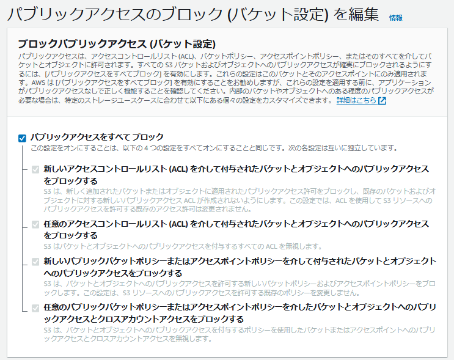
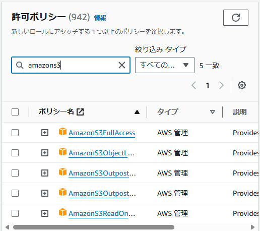
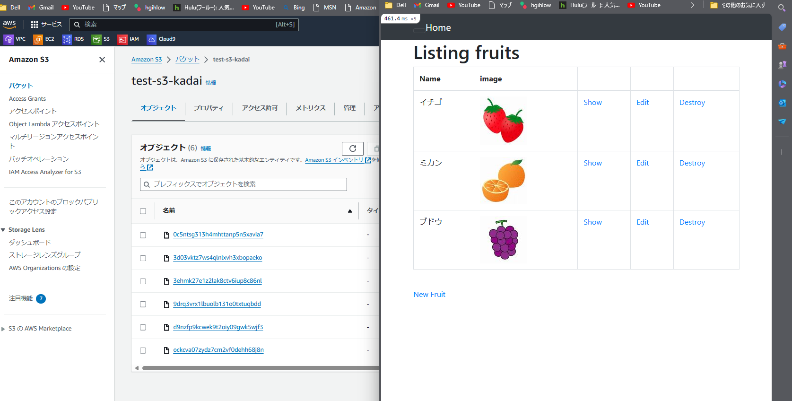

# 6 画像保存先をS3へ移動
6.1 s3バケットを作成 

- 以下画像のように設定  
  
  

6.2 EC2にiamロールを付与
- iamロールの作成(ポリシーはAmazonS3FullAccessを選択)  
   
  
  

6.3 アクセスキーの作成 
- IAM→ユーザー→セキュリティ認証情報で作成 
```bash:title 
#アクセスキーはそのまま使用すると危ないので環境変数に変換 
#~/.zshrcに格納 
export AWS_ACCESS_KEY_ID="IAMuserで作成したAccess key ID" 
export AWS_SECRET_ACCESS_KEY="IAMuserで作成したSecret access key" 
#ファイルの更新　
source ~/.zshrc 
```
6.4 storage.ymlを編集  
- 下記変更を加える  
[storage.yml](../img5/step6/storage.yml)
```bash:title 
amazon:
service: S3
region: ap-northeast-1 
bucket: バケット名
access_key_id: <%= ENV['AWS_ACCESS_KEY_ID'] %>
secret_access_key:  <%= ENV['AWS_SECRET_ACCESS_KEY'] %> 
``` 

6.5 environments/development.rbの編集 
- local;→amazon;  
[development.rb](../img5/step6/development.rb) 

6.6 ngnixとpumaを再起動してS3のオブジェクト確認 


6.7 構成図  


